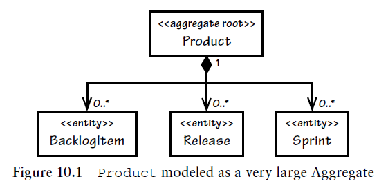
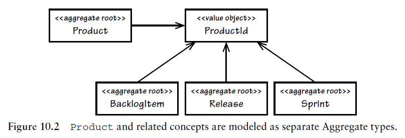
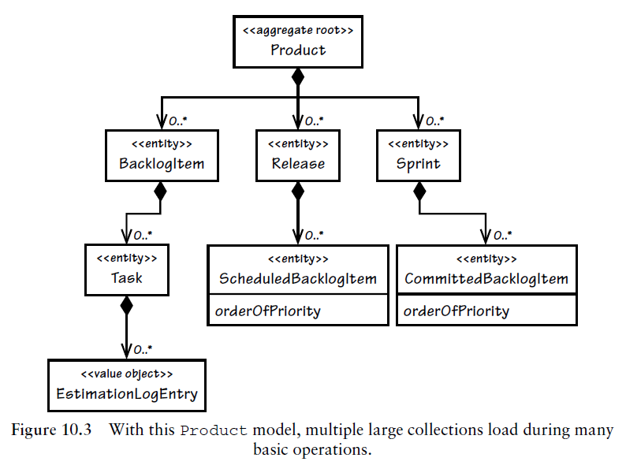
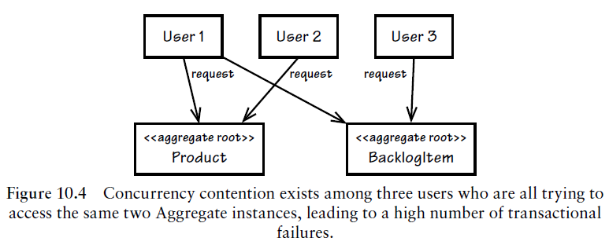
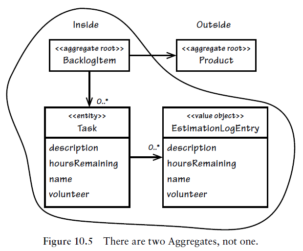
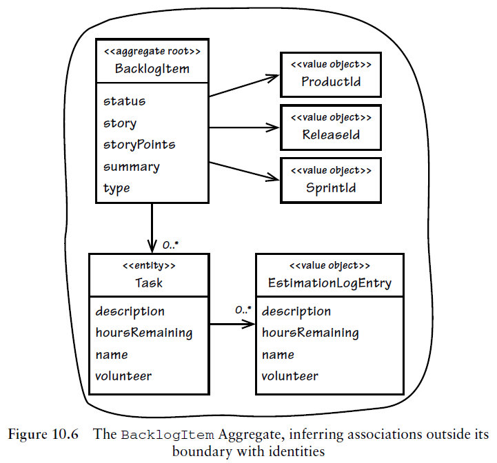
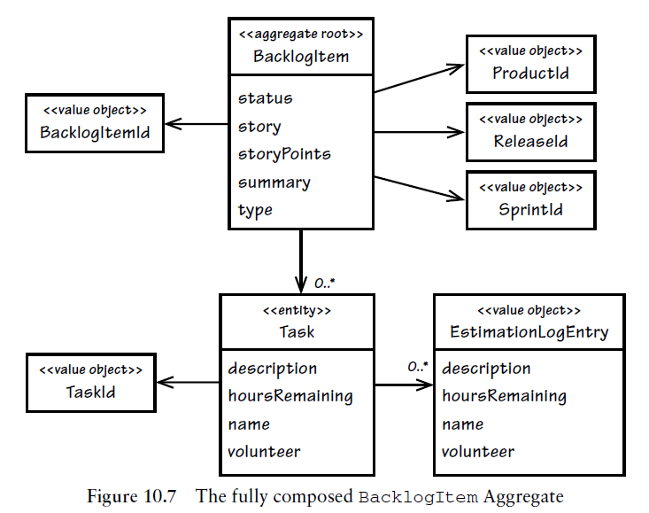
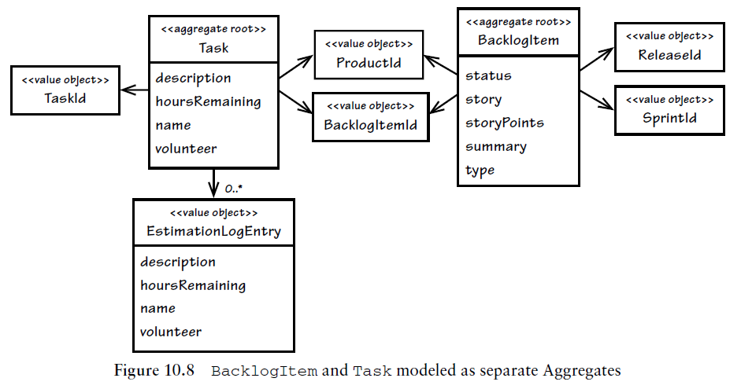

# 애그리게잇

- 애그리게잇은 모든 DDD 의 전술적인 지침 중에서도 무엇보다 정확히 규명되지 않은 패턴 중 하나다.
- 애그리게잇을 잘못 모델링하는 방식에는 여러 가지가 있다.
    - 컴포지션의 편의에 맞춰 설계하다 보면 애그리게잇을 너무 크게 만들어버리는 함정에 빠질 수 있다.
    - 반대로 애그리게잇을 모두 걷어내는 바람에 진정한 고정자를 보호하지 못하는 경우도 있다.

## 스크럼 핵심 도메인에서 애그리게잇 사용하기

- 프로젝트오베이션은 SaaS 모델을 사용한 애플리케이션이므로, 이를 구독하는 조직은 유비쿼터스 언어인 테넌트로 등록된다.
- 프로젝트오베이션이 애그리게잇을 생성하는 경험을 통해 함께 배워나가자
    - 최선의 객체 클러스터를 선정하는 방법은 무엇일까?
        - 애그리게잇 패턴은 컴포지션을 다루며 정보 은닉을 가능케 한다.
        - 애그리게잇에선 일관성 경계와 트랜잭션도 함께 다루게 된다.
    - 팀의 유비쿼터스 언어에 따른 고민들
        - 제품은 백로그 아이템과 릴리스, 스프린트를 포함한다.
        - 새로운 제품 백로그 아이템을 계획했다.
        - 새로운 제품 릴리스를 계획됐다.
        - 새로운 제품 스프린트의 일정을 수립했다.
        - 계획된 백로그 아이템에 관한 릴리스 일정을 수립할 수 있다.
        - 일정이 잡힌 백로그 아이템은 스프린트로 커밋할 수 있다.

### 첫 번째 시도: 큰 클러스터의 애그리게잇

- 개발자가 명세에 일관성 규칙을 추가한 이유
    - 객체들은 객체 그래프처럼 상호 연결돼야 했다.
    - 동시에 해당 객체의 수명주기를 유지관리하는 일도 아주 중요했다.
- 일관성 규칙
    - 백로그 항목을 스프린트로 커밋하면, 이를 시스템에서 제거하도록 허용해선 안 된다.
    - 스프린트가 백로그 항목을 커밋하면, 이를 시스템에서 제거하도록 허용해선 안 된다.
    - 릴리스가 백로그 항목의 일정을 수립하면, 이를 시스템에서 제거하도록 허용해선 안 된다.
    - 백로그 항목의 릴리스 일정을 수립하면, 이를 시스템에서 제거하도록 허용해선 안 된다.
- 결과
    - Product 는 먼저 아주 큰 애그리게잇으로 모델링됨.
    - 루트 객체인 Product 는 모든 BacklogItem, 모든 Release, 관련된 모든 Sprint 인스턴스를 포함.
    - 의도치 않은 클라이언트 제거가 일어나지 않도록 인터페이스 설계를 통해 모든 부분을 보호.
    - 이 설계는 아래와 같은 코드와 UML 다이어그램으로 표현됨.

```java
public class Product extends ConcurrencySafeEntity {
    private Set<BacklogItem> backlogItems;
    private String description;
    private String name;
    private ProductId productId;
    private Set<Release> releases;
    private Set<Sprint> sprints;
    private TenantId tenantId;
    ...
}
```



- 위와 같이 큰 애그리게잇이 처음엔 그럴싸해 보였지만, 실제론 실용적이지 않았다.
    - 애그리게잇 인스턴스는 Optimistic concurrency 를 활용해 영속성 객체를 동시에 중복 수정하지 않도록 보호하며, 데이터베이스 락의 사용을 피했다.
    - 요청 중 단 하나를 제외한 나머지 모두가 계속해서 실패한다.
    - 새 백로그 항목을 계획하는 일은 새로운 릴리스 일정의 수립과 논리적으로 아무런 상관이 없지만, 애그리게잇이 실제 비지니스 규칙이 아닌 잘못된 고정자를 기준으로 설계했다는 문제가 있다.
    - 잘못된 고정자는 개발자가 만들어낸 인위적인 제약 조건이다.
    - 트랜잭션 문제를 일으킬 뿐 아니라, 성능과 확장성의 측면에서도 안 좋은 영향을 미친다.

### 두 번째 시도: 다수의 애그리게잇



- 하나의 큰 애그리게잇을 네개로 쪼개면 Product 의 메소드 계약이 일부 변경되는데 다음과 같은 모습을 띄게 되는데 모든 메소드가 CQS 다.

```java
public class Product ... {
    ...
    public void planBacklogItem(
        String aSummary, String aCategory,
        BacklogItemType aType, StoryPoints aStoryPoints) {
        ...
    }
    ...
    public void scheduleRelease(
        String aName, String aDescription,
        Date aBegins, Date anEnds) {
        ...
    }
    public void scheduleSprint(
        String aName, String aGoals,
        Date aBegins, Date anEnds) {
        ...
    }
    ...
}
```

- 여러 애그리게잇으로 나눈 설계에선 다음과 같은 형태를 갖게 된다.

```java
public class Product ... {
    ...
    public BacklogItem planBacklogItem(
        String aSummary, String aCategory,
        BacklogItemType aType, StoryPoints aStoryPoints) {
        ...
    }
    public Release scheduleRelease(
        String aName, String aDescription,
        Date aBegins, Date anEnds) {
        ...
    }
    public Sprint scheduleSprint(
        String aName, String aGoals,
        Date aBegins, Date anEnds) {
        ...
    }
    ...
}
```

- 새롭게 설계된 메소드는 CQS 쿼리 계약을 맺고 있으며 팩토리로서 동작한다.
- 클라이언트가 백로그 항목의 계획을 세우려 하면, 애플리케이션 서비스는 다음과 같이 동작해야 한다.

```java
public class ProductBacklogItemService ... {
    ...
    @Transactional
    public void planProductBacklogItem(
        String aTenantId, String aProductId,
        String aSummary, String aCategory,
        String aBacklogItemType, String aStoryPoints) {

        Product product =
            productRepository.productOfId(
                new TenantId(aTenantId),
                new ProductId(aProductId));

        BacklogItem plannedBacklogItem =
            product.planBacklogItem(
                aSummary,
                aCategory,
                BacklogItemType.valueOf(aBacklogItemType),
                StoryPoints.valueOf(aStoryPoints));

        backlogItemRepository.add(plannedBacklogItem);
    }
    ...
}
```

- 트랜잭션 실패 문제를 해결했지만 클라이언트 관점에서 보면 네 개의 작은 애그리게잇 사용은 불편하다.
- Hibernate 에서 Optimistic Lock 옵션을 false 로 변경하고, BacklogItem, Release, Sprint 컬렉션이 무한히 커지도록 둔 채 Product 에서 일어나는 이런 수정을 무시하거나, 큰 클러스터의 애그리게잇을 유지하는데 드는 추가적인 비용은?
    - 애그리게잇이 통제할 수 없을 정도로 커질 수도 있다.

## 규칙: 진짜 고정자를 일관성 경계 안에 모델링하라

- 바운디드 컨텍스트에서 애그리게잇을 찾으려면 모델의 진짜 고정자를 이해해야 한다.
- 고정자(invariant): 언제나 일관성을 유지해야만 한다는 비지니스 규칙이다.
- 일관성
    - 트랜잭션적 일관성(transactional consistency): 즉각적으고 원자적이라 간주된다.
    - 결과적 일관성(eventual consistency)
- 일관성 경계: 어떤 오퍼레이션이 수행되든 상관없이 경계 안의 모든 대상이 특정 비지니스 고정자 규칙 집합을 준수하도록 논리적으로 보장해준다.
- 애그리게잇은 트랜잭션적 일관성 경계와 동의어다.
- 올바르게 설계된 애그리게잇은 단일 트랜잭션 내에서 완벽한 일관성을 유지하면서, 비지니스적으로 요구되는 모든 방식과 그 고정자에 맞춰 수정될 수 있어야 한다.
- 올바르게 설계된 바운디드 컨텍스트는 어떤 상황에서든 한 트랜잭션당 한 애그리게잇 인스턴스만을 수정한다.
- 트랜잭션 분석을 진행하지 않으면 애그리게잇 설계를 올바르게 판단할 수 없다.
- 전형적으로 고정자는 작은 애그리게잇으로 설계하는 편이 더 수월하다.

## 규칙: 작은 애그리게잇으로 설계하라

- 큰 클러스터의 애그리게잇을 유지하는 데 드는 추가적인 비용
    - 모든 트랜잭션이 성공한다고 보장되더라도, 큰 클러스터에는 여전히 성능과 확장성의 문제가 있다.
        - 사스오베이션이 좀 더 시장을 개발하고 나면 더 많은 테넌트가 생기고, 성능과 확장성은 무시할 수 없는 비기능적 요구사항이다.
        - 큰 클러스터 애그리게잇의 경우 백로그 항목을 더 추가하고 싶다면 이전 백로그를 모두 가져와야 될 수 있다.
        - 10.3 다이어그램 과 같이 0이 되는 상황은 거의 없으며 시간이 지남에 따라 이는 계속 증가하게 된다.
- 거짓 고정자와 컴포지션적 편의성이 설계를 주도했기 때문에 시작부터 문제가 있었으며, 트랜잭션의 성공적 종료, 성능, 확장성의 측면에서 안 좋은 영향을 미쳤다.



- 작은 애그리게잇을 설계할 때 '작다'는 단어는 어떤 수준을 의미할까?
    - 고유 식별자와 추가 특성 하나를 갖고 있는 애그리게잇을 생각해볼 수 있는데, 권장하지 않는 형태다.
    - 차라리 애그리게잇 루트엔터티와 최소한의 특성이나 값 타입의 속성으로 제한하자.
    - 정확히 필요한 만큼만 담고, 그 이상도 이하도 아니어야 한다.
- 필요한 만큼이 얼마만큼인가?
    - 도메인 전문가가 비니지스 규칙으로서 분명하게 인식하지 않더라도, 다른 대상과 일관성을 유지해야 할 필요가 있는 만큼.
- 애그리게잇을 구성하는 일부로서 값 객체를 선호하는 접근이 애그리게잇 자체가 불변한다는 의미는 아니며, 값 타입 속성을 대체하면 해당 루트 엔터티 자체가 변경된다.
- 높은 비율의 애그리게잇이 루트라는 하나의 엔터티만으로 구성할 수 있다.
- 크기가 작은 애그리게잇은 커밋을 가로막는 문제가 거의 일어나지 않기 때문에 트랜잭션이 성공할 가능성이 높다.

### 유스케이스를 전부 믿지는 말라

- 각 유스케이스는 현재의 모델 및 설계와 조화를 이뤄야 하며, 여기엔 애그리게잇에 관한 결정도 포함된다.
- 특정 유스케이스에서 애그리게잇 인스턴스를 여럿 수정해야 하는 문제가 종종 발생하는데, 사용자의 목적이 하나의 트랜잭션 안에서 이뤄질 경우 모델의 진짜 애그리게잇을 정확히 반영하지 못할 수 있음을 의심해봐야 한다.
- 애그리개잇의 경계가 실제 비지니스 제약 조건과 잘 맞는다고 가정한다면, 비지니스 분석가가 그림 10.4 에서 나타난 내용을 명세할 땐 문제가 발생할 수 있다.
    - 커밋 순서의 다양한 조합을 고려할 때 세개의 요청 중 두 가지는 실패할 수 있다는 점을 알 수 있다.
    - 여러 애그리게잇 인스턴스 사이의 일관성을 유지하려는 노력은 고정자를 놓치고 있다는 의미일 수 있다.
    - 새롭게 발견한 비지니스 규칙을 처리하기 위해 여러 애그리게잇을 하나의 애그리게잇으로 합쳐서 새로운 이름을 부여해야 할 수도 있다.



- 새로운 유스케이스는 애그리게잇을 리모델링해야 한다는 이해로 이어질 수 있지만, 이때에도 모델이 큰 클러스터 애그리게잇의 설계로 이어지지 않도록 비판적 시각을 유지해야 한다.
- 하나의 트랜잭션 내에서 일관성을 유지해주길 기대하는 유스케이스가 주어졌다고 해서 반드시 지켜야 하는것은 아니며, 이런 경우 대부분 결과적 일관성을 통해 비지니스 목표를 달성할 수 있다.
    - 적혀 있는 그대로 따르기만 한다면 통제하기 힘든 설계로 이어질 수도 있다.
    - 팀은 유스케이스를 다시 써야 할 수 있고, 새로운 유스케이스에선 결과적 일관성과 허용 가능한 업데이트 지연시간을 명시하게 된다.

## 규칙: ID로 다른 애그리게잇을 참조하라

- [Evans]에선 애그리게잇이 다른 애그리게잇 루트로의 참조를 가질 수 있다고 했다.
    - 이는 참조된 애그리게잇을 참조하고 있는 애그리게잇의 일관성 경계 안쪽으로 위치시킨다는 의미가 아니다.
    - 여전히 그림 10.5 와 같이 두 개의 애그리게잇이 존재한다.

- 자바에서 이 연결은 다음과 같이 모델링 된다. 즉 BacklogItem 은 Product 와 직접 연결된다.

```java
public class BacklogItem extends ConcurrencySafeEntity {
    ...
    private Product product;
    ...
}
```



- 논의했던 내용과 이어서 다룰 내용
    1. 참조하는 애그리게잇과 참조된 애그리게잇을 같은 트랜잭션 안에서 수정해선 안 된다.
    2. 하나의 트랜잭션에서 여러 인스턴스를 수정하고 있다면 일관성 경계가 잘못됐다는 신호일 가능성이 높다.
    3. 2번의 시점에 맞춰 변화를 시도할 때 크게 묶여 있는 애그리게잇에 영향을 미친다면, 이는 원자적 일관성 대신 결과적 일관성을 사용해야 한다는 표시일 수 있다.

### 애그리게잇이 ID 참조를 통해 서로 함께 동작하도록 해보자

- 외부 애그리게잇보다는 참조를 사용하되, 객체 참조를 직접 사용하지 말고 전역 고유 식별자를 이용하자. (그림 10.6)



- 다음과 같이 소스를 리팩토링 한다.

```java
public class BacklogItem extends ConcurrencySafeEntity {
    ...
    private ProductId productId;
    ...
}
```

- 추론 객체 참조(inferred object reference)를 가진 애그리게잇은 참조를 직스 가져올 필요가 없기 때문에 더 작아지고, 성능도 나아진다.

### 모델 탐색

- 단절된 도메인 모델(Disconnected Domain Model) 기법
    - ID를 통한 참조를 사용한다고 모델을 전혀 탐색할 수 없는 건 아니며, 애그리게잇 내부에서 리파지토리를 사용하는 방법을 단절된 도메인 모델 기법이라고 한다.
    - 지연로딩의 한 형태
- 애그리게잇의 행동을 호출하기에 앞서 리파지토리나 도메인 서비스를 통해 의존 관계에 있는 객체를 조회하는 방법도 있다.

```java
public class ProductBacklogItemService ... {
    ...
    @Transactional
    public void assignTeamMemberToTask(
        String aTenantId,
        String aBacklogItemId,
        String aTaskId,
        String aTeamMemberId) {

        BacklogItem backlogItem =
            backlogItemRepository.backlogItemOfId(
                new TenantId(aTenantId),
                new BacklogItemId(aBacklogItemId));

        Team ofTeam =
            teamRepository.teamOfId(
                backlogItem.tenantId(),
                backlogItem.teamId());

        backlogItem.assignTeamMemberToTask(
            new TeamMemberId(aTeamMemberId),
            ofTeam,
            new TaskId(aTaskId));
    }
    ...
}
```

- 어떤 애그리게잇이 다른 애그리게잇으로의 접근을 획득하는 방법이 무엇이든, 하나의 요청이 여러 애그리게잇을 참조하더라도 그중 둘 이상을 수정할 수 있는 자격이 주어지진 않는다.
- 모델이 오직 ID만을 사용해 참조하도록 제한한다면 클라이언트에게 사용자 인터페이스 뷰를 조합해서 보여주기가 더욱 어려워질 수 있다.
    - 세타 조인(theta join)이나 CQRS 의 사용도 고려해볼 수 있다.
    - CQRS나 세타 조인을 고려할 수 없는 상황이라면, 추론 객체 참조와 직접 객체 참조의 사이에서 균형을 잡아야 한다.

### 확장성과 분산

- 분산 저장소를 사용하거나 비슷한 목적으로 SQL 데이터베이스를 사용할 땐 ID를 통한 참조가 중요한 역할을 수행한다.
- ID를 통한 참조는 분산된 도메인 모델로 하여금 멀리 떨어진 대상과 연결을 형성하도록 해준다.
- 분산 시스템에 걸친 트랜잭션은 원자적이지 않고, 여러 애그리게잇이 결과적 일관성을 달성하도록 하고 있다.

## 규칙: 경계의 밖에선 결과적 일관성을 사용하라

- 하나의 애그리게잇 인스턴스에서 커맨드를 수행할 때 하나 이상의 애그리게잇에서 추가적인 비지니스 규칙이 수행돼야 한다면 결과적 일관성을 사용하자.
- 도메인 전문가는 지연된 일관성의 개념에 대해 때론 개발자보다 훨씬 더 관대할 수도 있다.
    - 도메인 전문가는 항상 다양한 유형의 지연이 발생하고 절대 즉각적 일관성을 유지할 수 없었던, 컴퓨터에 의한 자동화가 진행되기 이전 시절의 비지니스 활동을 떠올리곤 한다.
    - 도메인 전문가는 일관성을 달성할 때까지의 합리적인 지연을 허용할 의지가 있다.
- DDD 모델 내에서 결과적 일관성을 지원하는 실용적인 방법
    - 애그리게잇 커맨드 메소드는 하나 이상의 비동기 구독자에게 제때 전달되는 도메인 이벤트를 발행한다.
    - 각각의 구독자가 다른 유형의 애그리게잇 인스턴스를 가져오고, 그에 기반해 동작을 수행한다.
    - 각 구독자는 분리된 트랜잭션 내에서 수행되며, 트랜잭션당 하나의 인스턴스만을 수정한다는 애그리게잇 규칙을 따른다.

```java
public class BacklogItem extends ConcurrencySafeEntity {
    ...
    public void commitTo(Sprint aSprint) {
        ...
        DomainEventPublisher
            .instance()
            .publish(new BacklogItemCommitted(
                this.tenantId(),
                this.backlogItemId(),
                this.sprintId()));
    }
    ...
}
```

- 구독자가 수정에 실패하면?
    - 구독자가 메시징 매커니즘을 통해 수정 성공을 알리지 않으면 수정을 재시도할 수 있다.
    - 재시도 프로세스는 일관성이 달성될 때까지나 재시도 제한에 이를 때까지 계속된다. (제한된 지수 백오프, Capped Exponential Back-off)
    - 완전히 실패하게 된다면, 그에 따른 대응을 하거나 최소한 대기 중인 관련 작업을 위해 실패했음을 알려야 한다.

### 누가 해야 하는 일인지 확인하자

- 원자적 트랜잭션이나 결과적 일관성 중 어떤 방향을 선택하든 특정 도메인에 들어맞는 답이라기보다는 기술적인 선호일 뿐이다.
- 유스케이스를 논의할 때 데이터의 일관성을 보장하는 주체가 유스케이스를 수행하는 사용자의 일인지를 질문해보자.
    - 그렇다면 트랜잭션을 통해 일관성을 보장하도록 하자.
    - 다른 사용자나 시스템이 해야 할 일이라면 결과적 일관성을 선택하자.
    - 대부분의 상황에서 이를 통해 모델에 대한 더 싶은 통찰을 얻을 수 있다.

## 규칙을 어겨야 하는 이유

- 하나의 트랜잭션에서 여러 애그리게잇 인스턴스를 저장하기로 결정할 네가지 이유에 대해 논의한다.

### 첫 번째 이유: 사용자 인터페이스의 편의

- 편의를 위해 사용자가 한 번에 여러 일의 공통 특성을 정의해 배치를 생성할 수 있도록 허용할 때
    - 여러 팀원이 서너 개의 백로그 아이템을 배치로 생성하고자 할 때 만날 수 있는 상황
    - 사용자 인터페이스에선 모든 공통 속성을 하나의 섹션에 넣은 후 차이가 나는 몇 가지 속성을 개별적으로 추가하도록 해서 반복된 움직임을 줄일 수 있다.
- 애그리게잇 인스턴스를 배치를 통해 한 번에 생성하는 방식과 반복적으로 하나씩 생성하는 방식 사이에 차이점이 없다면, 규칙을 깨더라도 문제가 되지 않는 한 가지 이유가 된다.

```java
public class ProductBacklogItemService ... {
    ...
    @Transactional
    public void planBatchOfProductBacklogItems(
        String aTenantId, String productId,
        BacklogItemDescription[] aDescriptions) {

        Product product =
            productRepository.productOfId(
                new TenantId(aTenantId),
                new ProductId(productId));

        for (BacklogItemDescription desc : aDescriptions) {
            BacklogItem plannedBacklogItem =
                product.planBacklogItem(
                    desc.summary(),
                    desc.category(),
                    BacklogItemType.valueOf(desc.backlogItemType()),
                    StoryPoints.valueOf(desc.storyPoints()));

            backlogItemRepository.add(plannedBacklogItem);
        }
    }
    ...
}
```

### 두번째 이유: 기술적 메커니즘의 부족

- 프로젝트가 결과적 일관성을 위해 필요한 메시징, 타이머, 백그라운드 스레드와 같은 메커니즘을 전혀 제공하지 않고 있다면?
    - 이런 상황에선 주의하지 않으면 다시 큰 클러스터의 애그리게잇을 설계하는 방향으로 기울지도 모른다.
    - 시스템의 애그리게잇을 전반적으로 변경해, 모델을 통해 문제를 해결할 수 있다.
- 사용자와 애그리게잇 사이의 연관성은 규칙에서 벗어내도 될 이유를 더해주는 또 하나의 요소.
    - 한명의 사용자가 오직 하나의 애그리게잇 인스턴스 집합에만 집중해야 하는 비지니스 워크플로우인지 질문해보자.
    - 연관성을 확실히 한다면 하나의 트랜잭션에서 여러 애그리게잇을 변경하는 결정을 좀 더 합리적으로 내릴 수 있고, 고정자 위반과 트랜잭션 충돌을 막는 데 도움이 된다.
    - 동시성 충돌은 낙관적 동시성을 통해 애그리게잇을 보호할 수 있고, 드물게 발생하는 동시성 출동은 간단히 복구할 수 있다.
- 설계를 변경할 수 없는 상황에선, 다수의 애그리게잇 인스턴스를 하나의 트랜잭션에서 수정하는 편이 더 바람직할 수 있다.

### 세번째 이유: 글로벌 트랜잭션

- 글로벌한 2단계 커밋 트랜잭션을 엄격히 지켜 사용해야 할 때
    - 적어도 단기간 내에선 지연될 가능성이 거의 없어야 하는 상황 중 하나
    - 글로벌 트랜잭션을 사용한다고 해도, 바운디드 컨텍스트 내에서 다수의 애그리게잇 인스턴스를 한 번에 수정할 필요는 없다.
    - 글로벌 트랜잭션의 단점: 2단계 커밋을 사용하지 않을 수 있는 상황에서 달성할 수 있었을 확장성을 얻을 수 없고, 그에 따라 즉각적인 일관성을 보장할 수 없게 된다는 점.

### 네번째 이유: 쿼리 성능

- 리파지토리의 쿼리 성능 문제를 해결하는데 다른 애그리게잇으로의 직접 객체 참조를 유지하는 편이 최선일 때가 있다.
    - 잠재적인 크기와 전반적인 성능이라는 상충점이 의미하는 바를 고려해 신중하게 선택해야 한다.

### 규칙을 지키기

- 경험에만 의존해서 애그리게잇 규칙을 지키지 않아야 할 변명거리를 찾진 말아야 한다.
- 장기적으로는 규칙을 지키는 편이 프로젝트에 이익이 된다.

## 발견을 통해 통찰 얻기

### 설계를 다시 한 번 생각해보자

- 큰 클러스터의 Product 를 쪼개는 리팩토링 후 BacklogItem 은 자신만의 애그리게잇을 갖게 된다. (그림 10.7)
- 각 BacklogItem 은 전역 고유 식별자인 BacklogItemId 를 가지며, 다른 애그리게잇으로 이어진 모든 연결은 ID 를 통해 알 수 있다.



- 잠재적인 오버헤드를 비롯해 큰 클러스터의 Product 를 설계할 때 오류가 있었기 때문에 팀은 바운디드 컨텍스트안에 위치한 모든 애그리게잇의 크기를 줄이는 임무에 착수했다.
- 프로젝트오베이션 개발자들의 의문
    - BacklogItem 과 task 사이의 관계에서 유지했어야만 하는 진정한 고정자가 있었을까?
    - 연결을 좀 더 쪼개서 두 개의 개별 애그리게잇으로 안전하게 나눌 수 있는 또 하나의 경우였을까?
    - 이 설계를 지금 그대로 유지하는 데 필요한 총비용은 얼마일까?
- 위 의문에 대한 올바른 결정을 내리는 열쇠는 다음의 유비쿼터스 언어에 있다.
    - 백로그 항목의 태스크에 진전이 있다면, 팀원은 태스크 수행의 남은 시간을 예측한다.
    - 팀원이 특정 태스크의 남은 시간을 0시라고 예측했다면, 백로그 항목은 남은 시간이 있는지 모든 태스크를 확인한다. 모든 태스크의 남은 시간이 0이라면, 백로그 항목의 상태가 자동으로 완료로 변경된다.
    - 팀원이 특정 태스크에 한 시간 이상이 남아있다고 예측했지만 백로그 항목이 이미 완료 상태라면, 상태가 자동으로 복구된다.
- 태스크 시간의 총합과 백로그 항목의 상태가 일관성 있게 유지된다면, 그림 10.7이 올바른 애그리게잇 일관성 경계를 규명한 듯 보인다.
- 팀은 현재 클러스터가 성능과 학장성에 있어서 얼마나 비용을 소모할지도 생각해봐야 한다.
    - 백로그 항목의 상태를 남은 태스크 시간의 총합에 따른 결과적 일관성으로 달성할 수 있을 때 절약할 수 있는 비용과 비교하게 된다.
    - 결과적 일관성을 적용할 수 있는 전형적인 기회로 판단하겠지만, 트랜잭션 일관성의 접근법을 분석해 보고, 결과적 일관성을 사용했을 때 얻을 수 있는 게 무었인지에 따라 결정을 할 수 있다.

### 애그리게잇 비용의 예측

- 그림 10.7 처럼 각 Task 는 EstimationLogEntry 인스턴스 집합을 갖고 있을때 BacklogItem 이 갖고 있는 Task 요소의 수와 주어진 Task 가 갖고 있는 EstimationLogEntry 요소의 수의 예측에는 '봉투 뒷면에 계산하는 방법 BOTE, Back-of-the-envelop' 이 도움이 될 수 있다.

### 일반적인 사용 시나리오

- 여러가지 가상의 시나리오에 의해 개발자는 실제로 여러 사용자가 정기적으로 태스크를 함께 추가하길 원한다는 점을 알게 되면, BacklogItem 과 Task 를 두 개의 개별 애그리게잇으로 분리하는 방향이 될 수 있다.
    - 이런 선택은 여러 태스크가 동시에 커질 수 있도록 할 때도 의미가 있는데, 특히 이로 인해 성능과 확장성 문제가 발생하지 않는다면 더욱 그렇다.

### 메모리 소비

- 태스크를 위한 지연 로딩과 추정 로그 엔트리를 위한 지연 로딩 같은 두번의 지연 로딩을 유발하며, 팀은 여러 번의 가져오기 동작에서 발생할 수 있는 오버헤드를 조사하기 위해 테스트해야 한다.
- 프로젝트오베이션 개발자는 BOTE 로 애그리게잇 비용 및 메모리 소비에 대해 결론을 내릴 수 없으므로 팀의 관심사를 잘 반영한 설계라 자신하기에는 여전히 변수가 너무 많다고 판단했다.

### 또 다른 설계 대안 살펴보기



- 팀은 Task 가 애그리게잇에 의존적이지 않도록 하려면 무엇을 해야 할지, 그리고 의존성을 끊는 편이 도움이 되긴 할지 생각해보고자 했다. (그림 10.8)
- 이 설계에 따르면 최고의 성능을 위해 모든 예측 로그 엔트리를 지연 없이 즉시 로드하는 옵션도 선택할 수 있다.
- 결과적 일관성을 사용해야 했으며, 도메인 전문가와 논의 끝에 예측과 완료 상태로의 설정 사이에 발생하는 지연시간을 허용할 수 있다는 점을 알게 됐다.

### 결과적 일관성의 구현

- Task 가 estimateHoursRemaining() 커맨드를 처리할 때 해당하는 도메인 이벤트가 발행되며, 팀은 이 이벤트를 활용해서 결과적 일관성을 달성할 것이다.

```java
public class TaskHoursRemainingEstimated implements DomainEvent {
    private Date occurredOn;
    private TenantId tenantId;
    private BacklogItemId backlogItemId;
    private TaskId taskId;
    private int hoursRemaining;
    ...
}
```

- 특수화된(specialized) 구독자는 이를 리스닝 하면서, 일관성 처리를 조정하기 위해 도메인 서비스로 위임한다.
    - 식별된 BacklogItem 을 가져오기 위해 BacklogItemRepository 를 사용한다.
    - 식별된 BacklogItem 과 연결된 모든 Task 인스턴스를 가져오기 위해 TaskRepository 를 사용한다.
    - 도메인 이벤트의 hoursRemaining 과 가져온 Task 인스턴스를 전달해 estimateTaskHoursRemaining 이라는 이름의 BacklogItem 커맨드를 실행한다.

- 리파지토리를 통해 모든 Task 인스턴스를 가져오는 대신, 단순히 데이터베이스의 계산을 통해 모든 Task 시간의 합계를 알 수 있는 방식으로 최적화 할 수 있다.

```java
public class HibernateTaskRepository implements TaskRepository {
    ...
    public int totalBacklogItemTaskHoursRemaining(
        TenantId aTenantId,
        BacklogItemId aBacklogItemId) {

        Query query = session.createQuery(
            "select sum(task.hoursRemaining) from Task task "
            + "where task.tenantId = ? and "
            + "task.backlogItemId = ?");
        ...
    }
}
```

- 결과적 일관성 때문에 사용자 인터페이스가 복잡해 질 수 있다.
    - 뷰는 백그라운드 Ajax 폴링 요청을 사용할 수 있겠지만 이는 비효율적이다.
    - Comet(Ajax push) 에 의존할 수도 있다.
    - 스크린상에 시각적 큐를 사용해 사용자에게 현재 상태가 활실하지 않다고 안내할 수도 있다.
    - 뷰에서 재확인이나 새로 고침의 시간 간격을 제안할 수도 있다.
    - 렌더링된 뷰에 변경된 상태를 보여주는 방법도 있다.

### 이는 팀원이 할 일인가

- 하위 태스크 전체의 완료가 부모 백로그 완료로 자동으로 될지 수동으로 될지는 애플리케이션 설정으로 선택적으로 가능해야 한다.
- story 특성의 오버헤드에 대해 지연 로딩이나 아예 별도의 애그리게잇으로 설계해서 필요할 때마다 로드할 수 있다.
    - 외부 애그리게잇은 ID 로만 참조한다는 규칙을 어기기에 좋은 기회

### 결정의 시간

- 결정해야할 시간이 되면 열린 마음이 실용적 선택을 막게 된다.
- 팀이 이해한 바에 따르면 현재의 애그리게잇은 상당히 작기 때문에 Task 와 BacklogItem 을 분리하지 않기로 했으며, 실제 서비스에서 예상보다 애그리게잇의 크기가 커진다면둘로 나누면 된다.
- 찾아가는 시간을 부끄럽게 피하지 말고 부딪히자.
    - 이를 통해 핵심 도메인에 관해 더 깊은 통찰을 얻을 수 있기 때문에 충분히 가치 있는 시간이 될 것이다.

## 구현

### 고유 ID 와 루트 앤터티를 생성하라

- 하나의 엔터티를 애그리게잇 루트로 모델링하라.
- 정제된 Product 모델은 다음과 같은 루트 엔터티의 선언에 이르게 된다.

```java
public class Product extends ConcurrencySafeEntity {
    private Set<ProductBacklogItem> backlogItems;
    private String description;
    private String name;
    private ProductDiscussion productDiscussion;
    private ProductId productId;
    private TenantId tenantId;
    ...
}
```

- ConcurrencySafeEntity 는 대리 식별자와 낙관적 동시성 버전을 관리하기 위해 사용한 계층 슈퍼 타입(Layered Supertype)이다.
- ProductRepository 의 구현은 nextIdentity() 를 통해 ProductId 를 UUID 로 생성토록 해준다.

```java
public class HibernateProductRepository implements ProductRepository {
    ...
    public ProductId nextIdentity() {
        return new ProductId(java.util.UUID.randomUUID().toString().toUpperCase());
    }
    ...
}
```

- nextIdentity() 를 사용하면 클라이언트의 애플리케이션 서비스가 전역 고유 식별자와 함께 Product 를 인스턴스화할 수 있다.

```java
public class ProductService ... {
    ...
    @Transactional
    public String newProduct(
        String aTenantId, aProductName, aProductDescription) {

        Product product =
            new Product(
                new TenantId(aTenantId),
                this.productRepository.nextIdentity(),
                "My Product",
                "This is the description of my product.",
                new ProductDiscussion(
                    new DiscussionDescriptor(DiscussionDescriptor.UNDEFINED_ID),
                    DiscussionAvailability.NOT_REQUESTED));

        this.productRepository.add(product);

        return product.productId().id();
    }
    ...
}
```

- 애플리케이션 서비스는 ProductRepository 를 사용해 ID 를 생성하고, 새로운 Product 인스턴스를 저장한다.
    - 새로운 ProductId 의 플레인 String 표현을 반환한다.

### 값 객체 파트를 선호하라

- 가능하다면 포함된 애그리게잇 파트를 엔터티보다는 값 객체로서 모델링하는 편을 선택하자.
    - 모델이나 인프라에서 의미 있는 오버헤디를 야기하지 않는다면, 완전히 대체될 수 있는 파트가 최선의 선택지다.

### '데메테르의 법칙'과 '묻지 말고 시켜라'를 사용하기

- '데메테르의 법칙과' '묻지 말고 시켜라' 모두 애그리케잇을 구현할 때 사용할 수 있는 설계 원칙으로, 둘 모두 정보 은닉을 강조한다.
- '데메테르의 법칙'
    - 최소 지식 원칙을 강조한다.
    - 모든 객체의 모든 메소드는 다음을 통해서만 메소드를 호출해야 한다.
        - 그 자신
        - 자신에게 전달된 매개변수
        - 자신이 인스턴스화하는 객체
        - 자신이 직접 액세스 할 수 있는 스스로가 포함된 파트 객체
- '묻지 말고 시켜라'
    - 객체에게 할 일을 알려줘야 한다는 점을 강조
    - 클라이언트 객체는 서버 객체에게 서버 객체가 갖고 있는 파트를 요구해선 안되며, 자신이 갖고 있는 상태에 기반해 결정해야 하고, 그 후에 서버 객체가 일을 하도록 만들어야 한다.

- 두 설계 원칙을 Product 에 적용하는 방법을 살펴보자.

```java
public class Product extends ConcurrencySafeEntity {
    ...
    public void reorderFrom(BacklogItemId anId, int anOrdering) {
        for (ProductBacklogItem pbi : this.backlogItems()) {
            pbi.reorderFrom(anId, anOrdering);
        }
    }

    public Set<ProductBacklogItem> backlogItems() {
        return this.backlogItems;
    }
    ...
}
```

- Product 는 클라이언트가 reorderForm() 을 사용해 자신이 갖고 있는 backlogItems 의 상태를 바꾸는 커맨드를 실행하도록 한다.
- ProductBacklogItem 의 퍼블릭 인터페이스가 제한적이기 때문에, 클라이언트는 Product 의 형태를 판단할 수 없다.
- 클라이언트는 절대 ProductBacklogItem 인스턴스로 상태 변경 커맨드를 수행하지 않는다.

```java
public class ProductBacklogItem extends ConcurrencySafeEntity {
    ...
    protected void reorderFrom(BacklogItemId anId, int anOrdering) {
        if (this.backlogItemId().equals(anId)) {
            this.setOrdering(anOrdering);
        } else if (this.ordering() >= anOrdering) {
            this.setOrdering(this.ordering() + 1);
        }
    }
    ...
}
```

- 하나뿐인 상태 변경 행동이 프로텍티드 메소드로 선언돼 감춰졌다.
- 클라이언트는 오직 Product 의 퍼블릭 reorderForm() 커맨드 메소드만을 사용하고 되며, 호출이 일어나면 Product 는 자신의 모든 ProductBacklogItem 인스턴스에게 내부 수정의 수행을 위임한다.
- '데메테르의 법칙'은 좀 더 제한이 많으며, 루트 너머의 애그리게잇 파트 탐색을 전혀 허용하지 않는다.
- '묻지 말고 시켜라' 원칙은 루트 너머의 탐색은 허용하지만, 애그리게잇 상태의 수정은 클라이언트에 속한 것이 아니라 애그리게잇에게 속해 있다는 점을 강조한다.

### 낙관적 동시성

- 애그리게잇 정의를 생각해보면, 버전은 오직 루트 앤터티에서만 관리하는 편이 안전할 듯 보인다.
- 다른 클라이언트가 Product 내부의 어느 위치에서든 특성이나 속성을 동시에 수정하는 상황을 막아준다.
- 하이버네이트는 ProductBacklogItem 파트 인스턴스의 수정을 Product 자체의 수정으로 생각하지 않는다.
- 이를 해결하기 위해서 일부 플래그를 더티로 바꾸거나, 단순히 직접 고유의 version 을 증가시키는 방법이 있다.

```java
public class Product extends ConcurrencySafeEntity {
    ...
    public void reorderFrom(BacklogItemId anId, int anOrdering) {
        for (ProductBacklogItem pbi : this.backlogItems()) {
            pbi.reorderFrom(anId, anOrdering);
        }
        this.version(this.version() + 1);
    }
    ...
}
```

- 이 코드는 리오더링 커맨드가 실제론 아무 영향이 없더라도 항상 Product 를 더티로 만든다는 점이다.
- 인프라의 관심사가 모델로 흘러 들어오게 되는데, 이는 피할 수 있다면 피해야 하는 올바르지 않은 도메인 모델링 방법이다.
- Product 와 그 ProductBacklogItem 인스턴스의 경우 backlogItems 를 수정하더라도 루트의 버전을 수정할 필요가 없을 가능성이 있다.
    - backlogItems 자체가 엔터티이기 때문에 자신만의 낙관적 동시성 version 을 가지고 있다.
- 모든 엔터티 파트를 버전 관리하는 방식이 항상 옳은 것은 아니며, 루트 버전의 변경이 고정자를 보호하는 유일한 방법이 될 때도 있다.
- 영속성 메커니즘이 제공하는 후크를 사용해 하이버네이트가 파트가 수정됐음을 알릴 때 수동으로 루트를 더티하는 방법을 선택하고 싶을 수도 있다.
    - 자식 파트와 부모 루트 사이의 양방향 연결을 유지할 때만 선택하는 방법
    - [Evans] 에선 일반적으로 대부분의 상황에서 양방향 연결을 권장하지 않고 있다.
    - 루트를 수정하는 일이 아주 어렵고 많은 비용이 든다면, 애그리게잇을 단순한 특성과 값 타입 속성만을 담고 있는 루트 엔터티로 쪼개야 함을 알려주는 단서일 수 있다.
- 전체 애그리게잇이 하나의 값으로 저장되고 그 값 자체가 동시성 충돌을 막아줄 때는 문제가 되지 않는다.
    - 키-값 저장소(NoSQL) 들이 비슷한 편의를 제공한다.

### 의존성 주입을 피하라

- 리파지토리나 도메인 서비스의 애그리게잇으로의 의존성 주입은 나쁘다.
- 의존 객체는 애그리게잇 커맨드 메소드가 호출되기 전에 찾아서 전달하는 편이 좋다.
